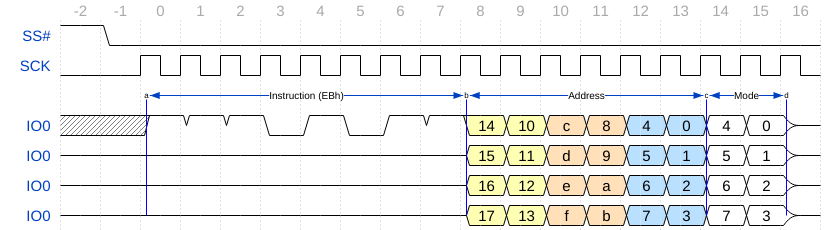

# SPI
Memory controller for SPI memory

## Features

### Internal interface
 - 8, 16, 32, 64 bit configurable
 - multiple initiators
 - optional FIFO
 - configurable cache
 - Boot from external memory

### External interface
 - single, dual and quad SPI
 - multiple chip support point-to-point
 - configurable clock phase
 - Execute-in-place (XIP) mode support
 - Double Data Rate (DDR) option
 - 24, 32 bit address
 - AutoBoot

## Supported memory ICs

 - Spansion [S25FL{004|008|016}K](https://www.spansion.com/Support/Datasheets/S25FL004K-016K_00.pdf)
 - Spansion [S25FL{116|132|164}K](http://www.spansion.com/Support/Datasheets/S25FL1-K_00.pdf) {16|32|64} Mib / 108MHz
 - Spansion [S25FL{128|256}S](http://www.spansion.com/Support/Datasheets/S25FL128S_256S_00.pdf) {128|256} Mib / 133MHz

 - Micron [N25Q128A](http://www.micron.com/~/media/Documents/Products/Data%20Sheet/NOR%20Flash/Serial%20NOR/N25Q/n25q_128mb_1_8v_65nm.pdf)
 - Micron [N25Q256A](http://www.micron.com/~/media/Documents/Products/Data%20Sheet/NOR%20Flash/Serial%20NOR/N25Q/n25q_256mb_3v_65nm.pdf)

## Quad mode timing


```js
{signal: [
  {name: 'SS#', wave: '10.................'},
  {name: 'SCK', wave: '0.p................'},
  {             node: '..a.......b.....c.d'},
  {name: 'IO0', wave: 'x.11101011334455==z', data: '14 10 c 8 4 0 4 0'},
  {name: 'IO0', wave: 'z.........334455==z', data: '15 11 d 9 5 1 5 1'},
  {name: 'IO0', wave: 'z.........334455==z', data: '16 12 e a 6 2 6 2'},
  {name: 'IO0', wave: 'z.........334455==z', data: '17 13 f b 7 3 7 3', node: '..A.......B.....C.D'}
],
  edge: ['a<->b Instruction (EBh)', 'b<->c Address', 'c<->d Mode', 'a-A', 'b-B', 'c-C', 'd-D'],
 head:{tock:-2}
}
```

## Clock modes


```js
{signal: [
  {name: 'mode:0, CPOL:0, CPHA:0', wave: '0.Pp......', phase: 0.5},
  {name: 'mode:1, CPOL:0, CPHA:1', wave: '0p.......l'},
  {name: 'mode:2, CPOL:1, CPHA:0', wave: '1.Nn......', phase: 0.5},
  {name: 'mode:3, CPOL:1, CPHA:1', wave: '1n.......h'},
  {name: 'SDI',                    wave: 'x========x', data: '7 6 5 4 3 2 1 0'},
]}
```
